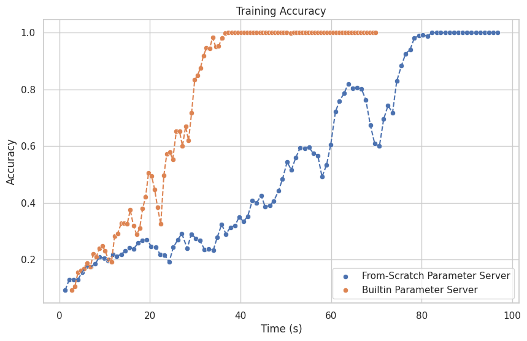
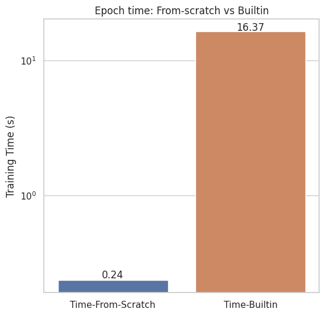
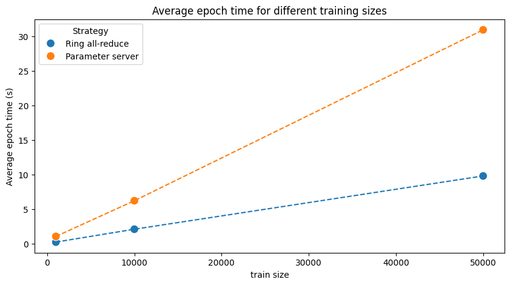

# Torch parallel from scratch

This is a toy implementation of two data parallelization techniques commonly used in machine learning:

1. **Parameter server** - one server that calculates gradients, centralized.
2. **Ring all-reduce** - all workers cooperate to calculate gradients, distributed.

For this implementation, only `torch.multiprocessing` module is used to handle process creation and communication. torch.multiprocessing is a wrapper for multiprocessing module in Python standard library, which enables sharing torch tensors.

## Quick start

To run one of the strategies, first setup the environment by installing the requirements (we recommend using conda enviroment):

```
conda create -n torch_parallel python=3.11
conda activate torch_parallel
pip install -r requirements.txt
```

Then, run the desired strategy:

```
python train.py --strategy {param_server | ring_all_reduce}
```

To run a training script with the predefined number of GPUs used, batch size, and number of epochs:

```
python train.py --strategy {param_server | ring_all_reduce} --n_gpus <gpus> --batch_size <batch_size> --epochs <epochs>
```

## About Strategies

### Parameter server

This strategy takes centralized approach - One GPU first shares the model weights with other GPUs, they train the model on their local data, and then send the gradients back to the central GPU. The central GPU then updates the model weights and shares them again.

If there are N GPUs used for training, available training data will be split to N-1 equal parts and passed to worker GPUs.

### Ring all-reduce

This strategy takes decentralized approach - All GPUs train the model on their local data, and then share the gradients with other GPUs. The gradients are averaged and then used to update the model weights.

**Update**:

Updating happens in two steps:

1. **Share-Reduce:** Gradient vector is split into N parts. In the first step, GPU i sends the i-th part of the gradient to the next GPU, in the ring topology. The gradients that are received are added to the local gradient.
In the next step, GPUs send the gradient that was aggregated in the previous step to the next GPU. This is repeated N-1 times.

    Result of this step is that each GPU has one part of the gradient vector fully summed up.

2. **Share-only:** In this step, each GPU just sends their fully aggregated part of the gradient to the other GPUs.


## Run torch builtin versions of the strategies

It is also possible to compare the implemented strategies with the torch builtin versions.

### Parameter server

For the parameter server builtin strategy, torch.nn.DataParallel is used. To run the builtin version, use the following command:

```
python param_server_builtin.py --n_gpus <gpus> --batch_size <batch_size> --epochs <epochs>
```

### Ring all-reduce

For the ring all-reduce builtin strategy, torch.nn.parallel.DistributedDataParallel is used. To run the builtin version, use the following command:

```
python ring_all_reduce_builtin.py --n_gpus <gpus> --batch_size <batch_size> --epochs <epochs>
```

## Experiments and Results

Experiments with the strategies are contained in the `experiments` folder. They are standalone jupyter notebooks that use the results saved in `results` folder. Results can be seen by just openning the notebooks.

### TL;DR results:


### Parameter server: From scratch vs builtin training accuracy



### Ring-all-reduce: From scratch vs builtin epoch time
This is on small dataset, hence drastic perf difference. Builtin torch DDP performs better with more training data.




### Scaling of strategies with respect to training data size


